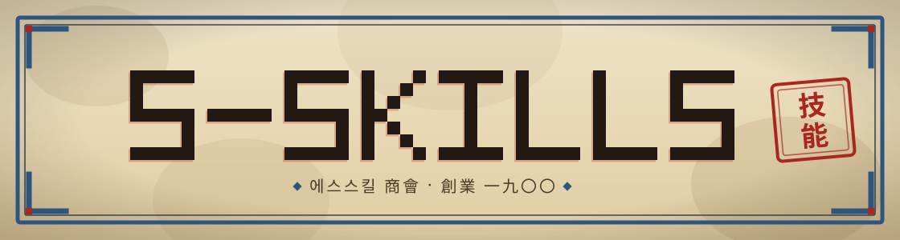

<p align="center">
  
</p>

<p align="center">
  <a href="https://github.com/s0613/S-skills/releases"></a>
  <a href="https://github.com/s0613/S-skills"></a>
  <a href="LICENSE"></a>
</p>

<br>

<p align="center">
  <strong>혼자서도 기업처럼.</strong>
</p>

<p align="center">
  PM, 디자이너, 개발자, QA, 보안 전문가가<br>
  Claude Code 안에서 팀처럼 움직입니다.
</p>

<br>

---

## 무엇을 하는가

S-skills는 **역할 기반 AI 개발 오케스트레이터**입니다.

요구사항 분석부터 설계, 구현, 리뷰, 배포까지 — 태스크를 말로 설명하면 필요한 전문가가 자동으로 투입됩니다. 사람처럼 협력하고, 결과만 돌려줍니다.

```
/sj-company 로그인 기능 만들어줘
```

```
[Medium] "로그인 기능 만들어줘"
필요한 역할: database, backend, security, frontend
디스패치 순서: 1) database  2) backend + security 병렬  3) frontend
```

---

## 핵심 역할

| 역할 | 하는 일 |
|------|--------|
| **PM** | 요구사항 분석, 리스크 검토, 우선순위 정의 |
| **Design** | 레퍼런스 DNA 기반 UI 설계, AI 티 제거 검수 |
| **Tech Lead** | 전문 서브에이전트 병렬 디스패치 + 결과 통합 |
| **Frontend** | UI·컴포넌트·접근성·반응형 구현 |
| **Backend** | API·서버·도메인 로직 구현 |
| **Security** | OWASP Top 10 + STRIDE 구현 + cross-cutting 리뷰 |
| **QA** | 독립 검증 — 구현자 산출물 참조 없이 직접 탐색 |

---

## 무엇이 다른가

**전문가 수준의 협업 프로토콜**

서브에이전트들은 Tech Lead를 거치지 않고 팀 채널에서 직접 조율합니다. Database가 "nullable 컬럼 주의"를 게시하면 Backend가 직접 읽고 처리합니다.

**취향이 쌓이는 디자인 시스템**

거부한 방향은 봉인되고, 승인한 방향은 누적됩니다. 시간이 지날수록 브랜드 정체성이 선명해집니다.

**QA 독립성 보장**

QA는 구현자가 작성한 요약 문서를 읽지 않습니다. PM 브리프와 실제 파일을 직접 탐색해 편향 없이 검증합니다.

---

## 시작하기

```bash
claude plugin install s0613/S-skills
```

```bash
# 로컬 개발
git clone https://github.com/s0613/S-skills.git ~/S-skills
ln -sf ~/S-skills/skills/harness ~/.claude/skills/s-skills
```

설치 후 어느 프로젝트에서나:

```
/sj-company <원하는 것을 말로>
```

---

## 주요 커맨드

| 커맨드 | 설명 |
|--------|------|
| `/sj-company <태스크>` | **모든 것의 시작점** — 태스크를 설명하면 적절한 전문가로 자동 라우팅 |
| `/spec` | 모호한 의도 → 5단계 실행 가능한 정밀 명세 |
| `/design` | 레퍼런스 브랜드 DNA 기반 UI 설계 — 역동/절제/균형 3개 시안 HTML 브라우저 확인 후 방향 선택 |
| `/design-shotgun` | 4–6개 방향 병렬 탐색 후 선택 |
| `/investigate` | 가설 수립 → 검증 강제, 추측성 수정 금지 |
| `/cso` | OWASP + STRIDE 보안 감사 |
| `/ship` | 테스트 → 커버리지 → PR 자동화 |
| `/retro` | 커밋·테스트·프로세스 마찰(friction)·성장 지표 주간 회고 |
| `/sj-agent-dev` | 10축 기반 비즈니스 에이전트 설계 |
| `/sj-loop` | 루프 프롬프트 생성 + 드라이런·세션 반복·클라우드 스케줄 실행 |
| `/outsource` | 막혔을 때 전문가 위임 — 맥락 리포트 + 메일 초안 자동 작성 |

---

## 구조

```
skills/
├── RESOLVER.md       ← 라우팅 단일 사실 (트리거 → 스킬 디스패치 테이블)
├── _conventions/     ← 횡단 규칙 단일 정의 (사람 게이트·PII·archive-only·Judge 독립성·RUN_ID)
├── sj-company/       ← 모든 스킬의 진입점 (Step 0이 RESOLVER.md를 읽어 디스패치)
├── sj-pm/            ← 요구사항 분석
├── sj-design/        ← UI 설계 + 디자인 리뷰
├── sj-tech-lead/     ← 서브에이전트 오케스트레이션
├── sj-qa/            ← 독립 검증
├── sj-spec/          ← 정밀 명세
├── sj-investigate/   ← 루트코즈 디버깅
├── sj-cso/           ← 보안 감사
├── sj-ship/          ← 릴리즈 자동화
├── sj-automation/    ← PC 시스템 자동화
├── sj-ui-auto/       ← 화면 UI 자동화
├── sj-marketing/     ← SNS·블로그 마케팅
├── sj-seo/           ← 검색 색인 자동화
├── sj-agent-dev/     ← 에이전트 설계
├── sj-agent-review/  ← 에이전트 리뷰
├── sj-loop/          ← 루프 엔지니어링
└── sj-outsource/     ← 전문가 위임
```

---

<p align="center">
  막히면 <code>/outsource</code> — 전문가가 이어받습니다.
</p>
