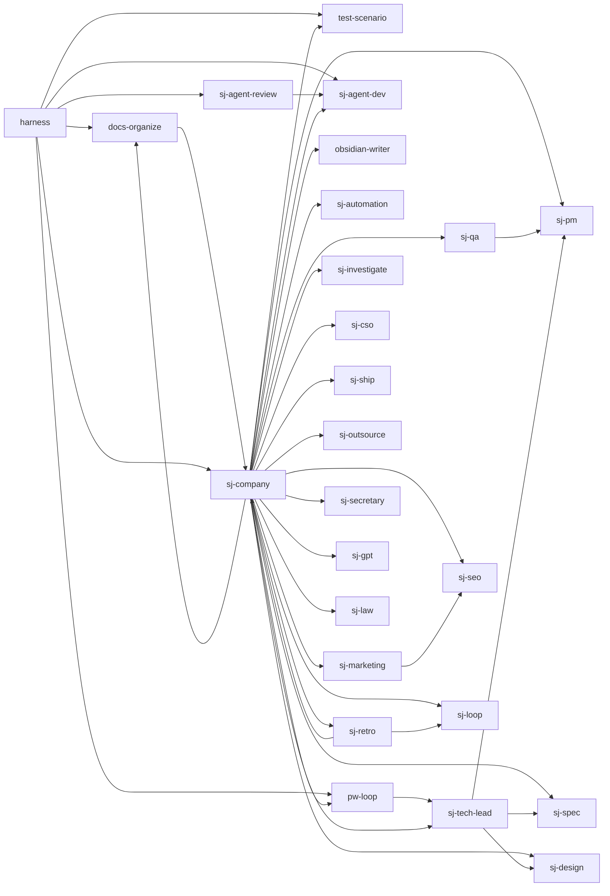

# Feature Map
> 이 프로젝트의 기능 목록과 서로의 연결. 코드와 같은 커밋에서 갱신된다.
> 갱신 규칙: s-skills `skills/_conventions/feature-map.md`

## 흐름

## 기능
| ID | 기능 | 진입점 | 핵심 파일 | 테스트 | 의존 |
|----|------|--------|-----------|--------|------|
| F01 | docs-organize — 코드베이스 분석·docs/ 생성·건강 점수 산출, remediate 모드 | `skills/docs-organize/SKILL.md` | `skills/docs-organize/` | `docs/superpowers/fixtures/behavior/libscan/` | F08 |
| F02 | harness — 프로젝트 상태 감지 후 docs-organize/test-scenario/pw-loop 오케스트레이션 (`/s-skills`) | `skills/harness/SKILL.md` | `skills/harness/` | 없음 | F01, F26, F04, F08, F06, F05 |
| F03 | obsidian-writer — Obsidian 볼트에 기능·작업·프로젝트 문서 작성 | `skills/obsidian-writer/SKILL.md` | `skills/obsidian-writer/` | 없음 | — |
| F04 | pw-loop — 기능 단위 Playwright 테스트 반복 루프 | `skills/pw-loop/SKILL.md` | `skills/pw-loop/` | 없음 | F25 |
| F05 | sj-agent-dev — 비즈니스 에이전트 아키텍처 설계·구현 안내 (10가지 설계 축) | `skills/sj-agent-dev/SKILL.md` | `skills/sj-agent-dev/` | 없음 | — |
| F06 | sj-agent-review — 에이전트 코드 리뷰, sj-agent-dev 10축 기준 PASS/WARN/FAIL 판정 | `skills/sj-agent-review/SKILL.md` | `skills/sj-agent-review/` | 없음 | F05 |
| F07 | sj-automation — PC 자동화 + UI 조작 + 네이티브 앱 제작 통합 | `skills/sj-automation/SKILL.md` | `skills/sj-automation/` | 없음 | — |
| F08 | sj-company — 하네스 v4 디스패처, RESOLVER 라우팅 + 크기별 파이프라인 실행 (`/sj-company`) | `skills/sj-company/SKILL.md` | `skills/sj-company/` | `docs/superpowers/fixtures/behavior/routing/` | F18, F25, F19, F03, F07, F22, F16, F24, F13, F05, F09, F23, F17, F20, F10, F21, F26, F04, F01, F15, F12, F14 |
| F09 | sj-cso — OWASP Top 10 + STRIDE 보안 감사 | `skills/sj-cso/SKILL.md` | `skills/sj-cso/` | 없음 | — |
| F10 | sj-design — 레퍼런스 DNA 기반 디자인 생성, 3안 제시 후 선택 구현 | `skills/sj-design/SKILL.md` | `skills/sj-design/` | 없음 | — |
| F11 | sj-dev-si — SI 문서(제안서·WBS·결과보고서 등) 6종 + 주간보고·견적서·도메인 맵 작성 | `skills/sj-dev-si/SKILL.md` | `skills/sj-dev-si/` | 없음 | — |
| F12 | sj-gpt — codex MCP 경유 GPT 자문 위임(리서치·세컨드 오피니언) | `skills/sj-gpt/SKILL.md` | `skills/sj-gpt/` | 없음 | — |
| F13 | sj-investigate — 가설 검증 기반 체계적 루트코즈 디버깅 | `skills/sj-investigate/SKILL.md` | `skills/sj-investigate/` | 없음 | — |
| F14 | sj-law — korean-law MCP로 법령·판례 원문 조회 + 인용 검증 | `skills/sj-law/SKILL.md` | `skills/sj-law/` | 없음 | — |
| F15 | sj-loop — 루프 프롬프트 생성 + 드라이런/세션 반복/클라우드 스케줄 실행 | `skills/sj-loop/SKILL.md` | `skills/sj-loop/` | 없음 | — |
| F16 | sj-marketing — SNS/블로그 마케팅 콘텐츠 기획·작성·검수 | `skills/sj-marketing/SKILL.md` | `skills/sj-marketing/` | 없음 | F22 |
| F17 | sj-outsource — 막힌 작업을 전문가에게 위임하는 리포트 생성 + 메일 초안 | `skills/sj-outsource/SKILL.md` | `skills/sj-outsource/` | 없음 | — |
| F18 | sj-pm — 요구사항·리스크·우선순위 분석, pm-brief.md 산출 | `skills/sj-pm/SKILL.md` | `skills/sj-pm/` | `docs/superpowers/fixtures/behavior/pmtask/` | — |
| F19 | sj-qa — pm-brief + 실제 변경분 독립 검증, PASS/FAIL/CONDITIONAL 판정 | `skills/sj-qa/SKILL.md` | `skills/sj-qa/` | `docs/superpowers/fixtures/behavior/qastale/` | F18 |
| F20 | sj-retro — 주간 회고, 배송 지표 + friction 로그로 Keep/Improve/Try 도출 | `skills/sj-retro/SKILL.md` | `skills/sj-retro/` | `docs/superpowers/fixtures/behavior/retrofriction/` | F08, F15 |
| F21 | sj-secretary — 전 프로젝트 PROJECT.md 기반 상태 보고 (읽기 전용) | `skills/sj-secretary/SKILL.md` | `skills/sj-secretary/` | `docs/superpowers/fixtures/behavior/triage/` | — |
| F22 | sj-seo — Google Search Console + Naver Search Advisor 색인 자동화 | `skills/sj-seo/SKILL.md` | `skills/sj-seo/` | 없음 | — |
| F23 | sj-ship — 테스트 → 커버리지 감사 → PR 오픈 릴리즈 자동화 | `skills/sj-ship/SKILL.md` | `skills/sj-ship/` | 없음 | — |
| F24 | sj-spec — 모호한 의도를 5단계로 실행 가능한 스펙으로 변환 | `skills/sj-spec/SKILL.md` | `skills/sj-spec/` | `docs/superpowers/fixtures/behavior/mapped/` | — |
| F25 | sj-tech-lead — pm-brief 기반 전문 서브에이전트 병렬 디스패치 + 리뷰 통합 | `skills/sj-tech-lead/SKILL.md` | `skills/sj-tech-lead/` | 없음 | F18, F24, F10 |
| F26 | test-scenario — 기능별 테스트 시나리오 생성 + 통과율 추적 사이클 | `skills/test-scenario/SKILL.md` | `skills/test-scenario/` | 없음 | — |

## 미매핑
- `skills/RESOLVER.md` — 라우팅 단일 사실 테이블 자체. 스킬(기능)이 아니라 F08(sj-company)이 소비하는 설정 파일이라 행으로 만들지 않았다.
- `skills/manifest.json`, `skills/VERSION` — 생성/버전 메타데이터, 스킬 아님.
- `skills/_conventions/` — 규칙 폴더(컨벤션 17개 + README), 스킬 아님. 태스크 브리핑 지시에 따라 제외.
- `/Users/songseungju/S-skills/test-scenario/SKILL.md` (repo 루트, `skills/` 밖) — `skills/test-scenario/`와 별개의 고아 사본으로 보인다. 어느 manifest·RESOLVER에도 연결되지 않아 기능으로 등록하지 않았다. Concerns 참고.
